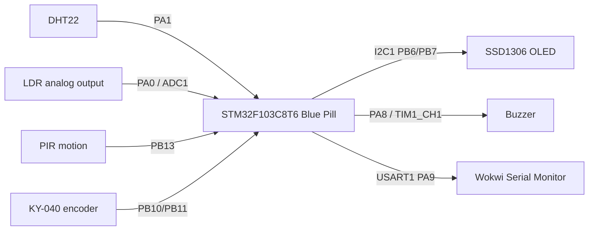
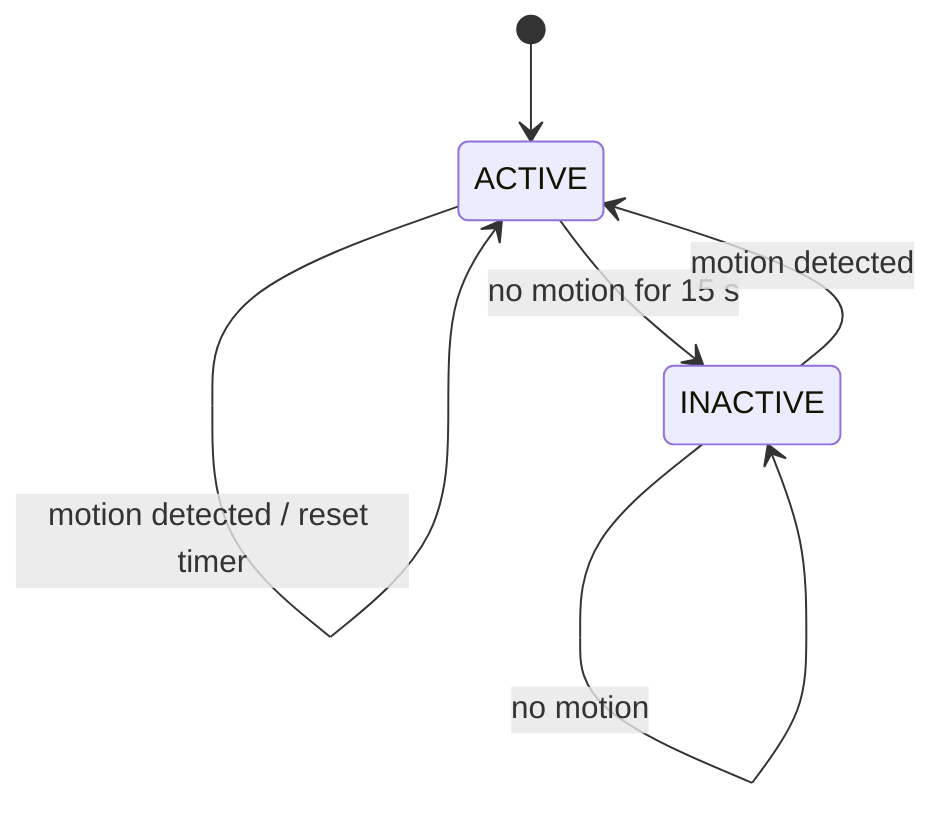
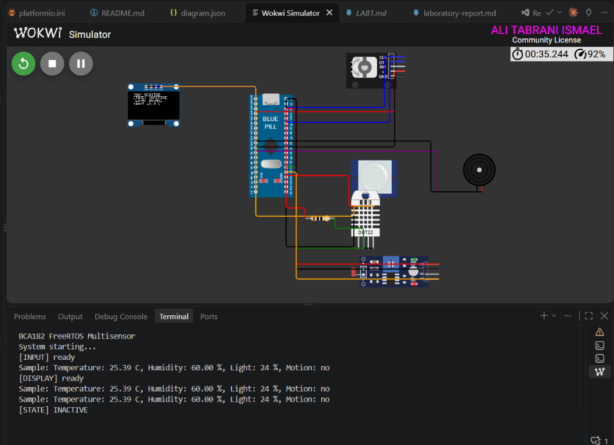
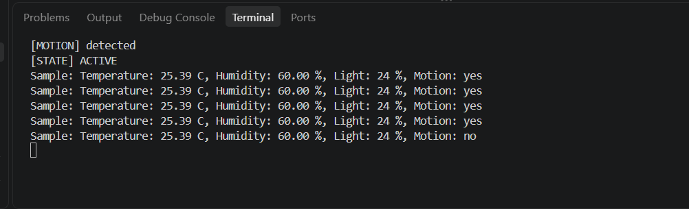

# FreeRTOS Multisensor Room Monitor

A simulated STM32F103C8T6 Blue Pill room-monitoring system for BCA182
Embedded Systems Programming Laboratory Activity No. 1. The firmware uses
native STM32Cube HAL and FreeRTOS APIs, with no Arduino framework. It reads
temperature, humidity, ambient light, and motion; displays a selected value on
an SSD1306 OLED; accepts rotary-encoder navigation; and controls a buzzer for
out-of-range temperature.

The project is designed for PlatformIO and Wokwi.

## Project Overview

The system is organized as six FreeRTOS tasks. Sensor acquisition, display,
input, motion, alarm, and activity-state management are separated so each task
has a focused responsibility and an explicit scheduling priority.

The room is normally `ACTIVE`. When no motion is detected for 15 seconds, the
system changes to `INACTIVE`. Motion detected by the PIR sensor returns the
system to `ACTIVE`.

## Features

- DHT22 temperature and humidity measurement.
- LDR ambient-light measurement represented as a relative 0-100% value.
- PIR motion detection sampled by a dedicated task.
- SSD1306 128x64 I2C OLED display.
- KY-040 rotary encoder navigation through temperature, humidity, light, and motion.
- Temperature alarm below 18.0 C or above 30.0 C.
- FreeRTOS tasks with explicit priorities and blocking delays.
- FreeRTOS queues for sensor, navigation, and motion communication.
- Event group for activity and motion signaling.
- Mutex protecting shared USART1 serial output.
- Hardware-independent alarm, navigation, and state-machine logic with Unity tests.

## Learning Objectives

This project demonstrates:

- STM32 Blue Pill development with PlatformIO and STM32Cube.
- Native FreeRTOS task creation, scheduling, delays, queues, event groups, and mutexes.
- Periodic execution using `vTaskDelayUntil()`.
- Separation of hardware drivers from deterministic decision logic.
- ACTIVE/INACTIVE state-machine design.
- Unit testing of embedded decision logic on the host.
- Wokwi-based functional verification and technical documentation.

## System Architecture



At startup, `main()` initializes the MCU and HAL peripherals, `app_main()`
creates the RTOS objects, creates the tasks, and starts the scheduler. The
tasks then operate concurrently and communicate through the objects created in
`src/rtos_objects.cpp`.

## FreeRTOS Architecture

| Task | Responsibility | Priority | Period or wait condition |
|---|---|---:|---|
| `SensorTask` | Read DHT22 and LDR; publish `SensorData` | 2 | 2500 ms with `vTaskDelayUntil()` |
| `DisplayTask` | Sole owner of the OLED; render the selected measurement | 1 | 500 ms with `vTaskDelayUntil()` |
| `InputTask` | Decode rotary-encoder transitions and send navigation commands | 3 | 5 ms delay |
| `MotionTask` | Read the PIR and signal motion changes | 3 | 100 ms delay |
| `AlarmTask` | Evaluate temperature, publish alarm state, and control buzzer PWM | 2 | 100 ms evaluation |
| `StateTask` | Manage `ACTIVE` and `INACTIVE` transitions | 2 | 100 ms delay |

Higher priorities are assigned to the encoder and PIR tasks because they
respond to short-lived input changes. Sensor, alarm, and state processing uses
priority 2 because it operates on slower environmental time scales. The OLED
is priority 1 because display refresh can tolerate more latency than input or
motion processing.

Every task performs finite work and then blocks. The periodic sensor and
display tasks use `vTaskDelayUntil()` so their execution schedule is based on a
fixed period and does not accumulate delay from the work performed in the
previous iteration.

## Hardware / Simulated Components

The complete Wokwi circuit is defined in [`diagram.json`](diagram.json).

| Component | Wokwi part | Purpose |
|---|---|---|
| STM32F103C8T6 Blue Pill | `board-stm32-bluepill` | Main microcontroller |
| DHT22 | `wokwi-dht22` | Temperature and humidity |
| Photoresistor | `wokwi-photoresistor-sensor` | Relative ambient light |
| PIR sensor | `wokwi-pir-motion-sensor` | Motion detection |
| KY-040 encoder | `wokwi-ky-040` | Display navigation |
| SSD1306 OLED | `board-ssd1306` | Measurement display |
| Buzzer | `wokwi-buzzer` | Temperature alarm |

## Pin Configuration

| Pin | Connection | Function |
|---|---|---|
| `PA0` | LDR `AO` | ADC1 analog input |
| `PA1` | DHT22 `SDA` | DHT22 data line |
| `PA9` | Wokwi serial monitor | USART1 TX, 115200 baud |
| `PA10` | Wokwi serial monitor | USART1 RX connection |
| `PB6` | OLED `SCL` | I2C1 clock |
| `PB7` | OLED `SDA` | I2C1 data |
| `PB10` | Encoder `CLK` | Rotary input |
| `PB11` | Encoder `DT` | Rotary input |
| `PA8` | Buzzer | TIM1_CH1, 1 kHz PWM alarm output |
| `PB13` | PIR `OUT` | Motion input |
| `PC13` | Blue Pill onboard LED | Heartbeat indicator |

The DHT22 data line uses a 10 kOhm pull-up resistor. The OLED uses I2C
address `0x3C`.

## Task Design

`SensorTask` reads the DHT22 and ADC input, converts the ADC reading into a
relative percentage, and writes the latest valid sample to `xSensorQueue`.
`DisplayTask` reads the latest sample and owns all OLED operations. It also
consumes navigation commands from `xNavQueue`.

`MotionTask` samples the PIR and writes its latest state to `xMotionQueue`.
`StateTask` uses the motion queue and event group to track inactivity. When the
15-second timeout expires it clears the active event bit; motion sets it again.
`AlarmTask` evaluates the latest sensor sample and enables the TIM1 PWM buzzer
for temperatures outside the configured range.

## Inter-Task Communication

| Object | Type | Producer | Consumer | Purpose |
|---|---|---|---|---|
| `xSensorQueue` | Length-1 queue | `SensorTask` | `DisplayTask`, `AlarmTask` | Latest `SensorData` sample |
| `xNavQueue` | Queue of `NavCommand` | `InputTask` | `DisplayTask` | Encoder navigation commands |
| `xMotionQueue` | Length-1 queue | `MotionTask` | `StateTask` | Latest PIR state |
| `xSystemEventGroup` | Event group | `MotionTask`, `StateTask` | `StateTask` and system tasks | Activity and motion event bits |
| `xSerialMutex` | Mutex | All diagnostic code | USART1 | Prevent interleaved serial output |

The sensor and motion queues are length-one latest-value mailboxes and use
`xQueueOverwrite()`. Consumers use `xQueuePeek()` where the latest sample must
remain available to another consumer. The mutex protects the shared UART
resource so competing task messages do not overlap on the serial monitor.

Event bits are defined in [`include/rtos_objects.h`](include/rtos_objects.h):

| Bit | Meaning | Set by |
|---|---|---|
| `EVENT_ACTIVE_BIT0` | The system is active | `StateTask` |
| `EVENT_MOTION_BIT1` | A motion event was detected | `MotionTask` |
| `EVENT_ALARM_BIT2` | The latest temperature is outside the normal range | `AlarmTask` |

## State Machine



While `ACTIVE`, the OLED refreshes, sensors are sampled, encoder navigation is
accepted, and temperature alarm processing runs. While `INACTIVE`, motion
monitoring remains available so the next PIR event can reactivate the system.
The transition decision is implemented by `evaluateSystemState()` and tested
separately through `evaluateSystemStateLogic()`.

## Repository Structure

```text
.
├── include/                 Public headers and FreeRTOS configuration
├── src/                     STM32 application and hardware modules
│   ├── main.cpp             HAL initialization, task creation, scheduler start
│   ├── rtos_objects.cpp     Queues, event group, and mutex creation
│   ├── dht22.c              DHT22 driver
│   ├── oled.cpp             SSD1306 display driver
│   ├── input.cpp            Rotary encoder task
│   ├── motion.cpp           PIR task
│   ├── alarm.cpp            Alarm task and temperature decision
│   └── system_state.cpp     ACTIVE/INACTIVE state task
├── test/test_logic/         Unity tests for hardware-independent logic
├── docs/                    Architecture diagrams, test evidence, and report
├── scripts/                 Native test toolchain helper
├── diagram.json             Wokwi circuit definition
├── wokwi.toml               Wokwi firmware configuration
└── platformio.ini           Build, native-test, and analysis environments
```

## Getting Started

Install Visual Studio Code with the PlatformIO extension. The Wokwi extension
is required to run the simulation in VS Code. PlatformIO downloads the STM32
platform, STM32Cube framework, FreeRTOS dependency, and toolchains during the
first build.

Clone and open the project:

```bash
git clone <repository-url>
cd bca182-freertos-multisensor
code .
```

## Building the Project

The default environment targets the STM32 Blue Pill and uses STM32Cube:

```bash
pio run
```

The firmware used by Wokwi is written to
`.pio/build/bluepill_f103c8/firmware.elf`.

## Running the Wokwi Simulation

1. Run `pio run` to build the firmware.
2. Open the project in VS Code.
3. Run **Wokwi: Start Simulator** from the Command Palette.
4. Use the DHT22, photoresistor, PIR, and encoder controls to exercise the system.
5. Observe the OLED and the Wokwi serial monitor.

### Wokwi run evidence

The following screenshots were captured from this project's Wokwi run:



The circuit ran with the Blue Pill, OLED, rotary encoder, PIR motion sensor,
buzzer, DHT22, and photoresistor connected. The serial monitor reported:

```text
BCA182 FreeRTOS Multisensor
System starting...
[INPUT] ready
Sample: Temperature: 25.39 C, Humidity: 60.00 %, Light: 24 %, Motion: no
[DISPLAY] ready
[STATE] INACTIVE
```

When motion was triggered, the PIR and state transitions were observed:



```text
[MOTION] detected
[STATE] ACTIVE
Sample: Temperature: 25.39 C, Humidity: 60.00 %, Light: 24 %, Motion: yes
Sample: Temperature: 25.39 C, Humidity: 60.00 %, Light: 24 %, Motion: no
```

Change the DHT22 temperature below 18.0 C or above 30.0 C to exercise the
buzzer alarm. Rotate the encoder to select temperature, humidity, light, or
motion. Leave the PIR inactive for approximately 15 seconds to exercise the
`INACTIVE` transition, then trigger motion to return to `ACTIVE`.

## Unit Testing

The native test environment compiles the hardware-independent decision logic
on the host machine:

```bash
pio test -e native
```

The current test suite contains 13 meaningful tests:

| Area | Coverage |
|---|---|
| Temperature alarm | Below, at, normal, at upper, and above upper limit |
| Display navigation | Forward, reverse, and wraparound |
| System state | Active timeout behavior, inactive persistence, and motion reactivation |

## Static Code Analysis

Run PlatformIO analysis with:

```bash
pio check
```

Record the findings, severity, cause, and resolution in the project
documentation after reviewing the output. Analysis results should not be
represented as complete until the command has been run against the final
source.

## Functional Verification

The complete documentation set is in [`docs/README.md`](docs/README.md),
including the architecture diagrams, [test plan](docs/test-plan.md),
[static-analysis record](docs/static-analysis.md), and
[laboratory-report draft](docs/laboratory-report.md).

The following tests should be recorded with both the observed behavior and a
PASS/FAIL result:

| Test | Stimulus | Expected result |
|---|---|---|
| FT-01 | Change DHT22 temperature | OLED and serial output update |
| FT-02 | Change DHT22 humidity | OLED and serial output update |
| FT-03 | Change LDR input | Relative light percentage changes |
| FT-04 | Rotate encoder clockwise | Next display mode is selected |
| FT-05 | Rotate encoder counterclockwise | Previous display mode is selected |
| FT-06 | Set temperature above 30 C | Alarm activates |
| FT-07 | Return temperature to normal | Alarm stops |
| FT-08 | Trigger PIR | System is or remains `ACTIVE` |
| FT-09 | Wait 15 seconds without motion | System becomes `INACTIVE` |
| FT-10 | Trigger PIR while inactive | System returns to `ACTIVE` |

### What is still missing

The Wokwi screenshots above document a real run and show motion detection,
`STATE: ACTIVE`, and `STATE: INACTIVE`. All ten Wokwi functional tests have
now been observed and recorded as **PASS** in
[`docs/test-plan.md`](docs/test-plan.md), with supporting screenshots in
`docs/screenshots/`.

| Test | Recorded observation |
|---|---|
| FT-01 | Completed: changing the DHT22 produced repeated serial readings of `Temperature: 11.80 C`. |
| FT-02 | Completed: changing the DHT22 produced repeated serial readings of `Humidity: 21.00 %`. |
| FT-03 | Completed: changing the photoresistor produced `Light: 1 %` in the serial monitor. |
| FT-04 | Completed: clockwise rotation selected the MOTION mode, shown by `[INPUT] mode: MOTION`. |
| FT-05 | Completed: counterclockwise rotation selected the TEMPERATURE mode, shown by `[INPUT] mode: TEMPERATURE`. |
| FT-06 | Completed: at 49.40 C, the OLED showed `ALARM: ACTIVE` and the buzzer indicator was visible, even while `STATE: INACTIVE`. |
| FT-07 | Completed: returning the DHT22 temperature to 18.00 C cleared the alarm; the OLED showed `ALARM: NORMAL` and the serial monitor reported `Temperature: 18.00 C`. |
| FT-08 | Completed: PIR motion produced `[MOTION] detected`, `[STATE] ACTIVE`, and subsequent samples with `Motion: yes`. Earlier `Motion: no` samples reflect the periodic sampling interval. |
| FT-09 | Completed: after no motion, the system showed `STATE: INACTIVE`. |
| FT-10 | Completed: motion while inactive returned the system to `STATE: ACTIVE`. |

The three deliberate FreeRTOS fault experiments have now been executed,
documented, and reverted. They are described in
[`docs/fault-experiments.md`](docs/fault-experiments.md). These experiments
were performed temporarily and the normal source was restored before
submission.

## Engineering Decisions

- **Native STM32Cube and FreeRTOS:** The laboratory requires STM32 HAL and
	native FreeRTOS APIs, so Arduino abstractions are not used.
- **Latest-value queues:** Sensor and motion consumers need the newest state,
	not a long history. Length-one queues prevent stale data from accumulating.
- **OLED ownership:** `DisplayTask` is the sole OLED owner, avoiding competing
	I2C writes from multiple tasks.
- **Periodic scheduling:** `vTaskDelayUntil()` keeps sensor and display work on
	a stable schedule and reduces timing drift.
- **Pure decision logic:** Alarm thresholds, navigation, and state transitions
	are exposed through hardware-independent functions so they can run in native
	Unity tests.
- **Relative light level:** The ADC reading is scaled to 0-100% of the ADC
	range. It is not calibrated lux.

## Limitations

- The light value is relative rather than a calibrated lux measurement.
- Wokwi simulation behavior may differ from physical STM32 timing and sensor noise.

## Future Improvements

- Export the laboratory-report draft to `docs/laboratory-report.pdf` after the
	report is finalized.
- Add encoder switch handling if the hardware configuration includes the KY-040
	push button.

## References and Acknowledgments

- BCA182 Embedded Systems Programming, Laboratory Activity No. 1,
	Mindanao State University - Iligan Institute of Technology.
- [PlatformIO documentation](https://docs.platformio.org/)
- [Wokwi documentation](https://docs.wokwi.com/)
- FreeRTOS and STM32Cube middleware provided through the PlatformIO project
	dependencies.
